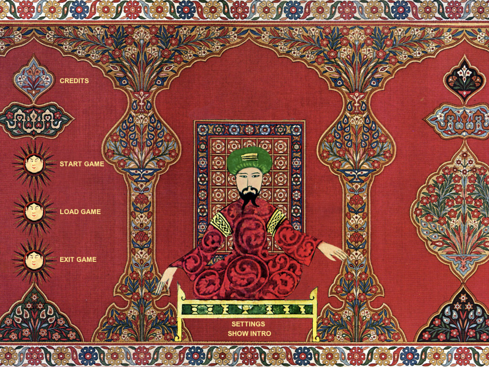

# Spicetrade

> Strategy video game written in Java Maintained by Taher Alkhateeb
> <taher@pythys.com>

Colonize Europe!

Start from nothing and dominate another continent. Spread the influence of your
culture while creating your own empire!

Since the 14th century, Europe has been a global super power when it started
colonizing other continents. But what if history had gone a different way? What
would Europe be like if Asia had prevailed?

Abu Al-Qazzaz is the main character in Spice Trade. He is a poor young man from
Baghdad, who has inherited a house and some land, and he wants to get married
too.

Abu decides to try his luck in the spice game. He has to prevent the European
countries from gaining a trade monopoly. Will Abu be able to beat out the
Europeans in the spice trade? Could Europe have been different? How? You decide!




## Table of Contents

- [Setup](#setup)
- [Usage](#usage)
- [Revival Initiative](#revival-initiative)

## Setup

### prerequisites

Java JRE version 21 or above

**ON LINUX:** Make sure to install alsa package for your sound server which is
either `pipewire-alsa` or `pulseaudio-alsa`

### Building

To build the system issue the below command

```bash
./gradlew clean build
```

## Usage

Once build is complete. The system can run using below command:

```bash
./gradlew run
```

## Revival Initiative

The original game was hosted in spicetrace.org but it discontinued and the copy
that remains is in [sourceforge](https://sourceforge.net/projects/spicetrade)

Moreover, the game source code no longer compiles with later versions of Java.
So it was updated to work with newer Java versions and the sound system was
redesigned and massively improved.
